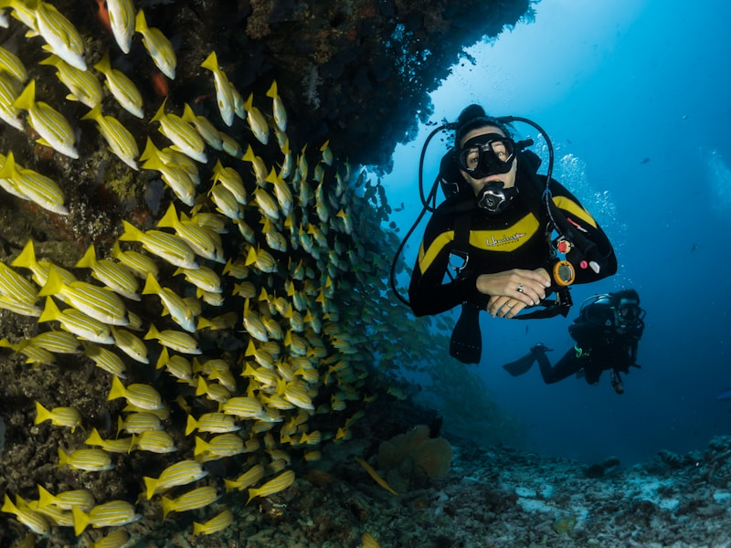

# AK Travel - Antalya Elit Turizm Acentesi Web Sitesi Şablonu


Antalya'daki elit turizm acenteleri için ücretsiz, SEO dostu ve mobil uyumlu web sitesi şablonu. Bootstrap 5 ile geliştirildi, birkaç saniyede klonlayıp çalıştırabilirsiniz!

**[Canlı Demoyu Görün](https://ak-hosting.github.io/ak-travel/)** | **[Destek için İletişime Geçin](mailto:ak@ak-pro.com)**

## 🚀 Özellikler

- **Modern Tasarım**: Mobil öncelikli, Bootstrap 5 ile responsive ve turistik estetik
- **Tur Tanıtımı**: Günlük turlar, tekne gezileri, kültür turları ve macera turları
- **İletişim/Rezervasyon Formu**: SMTP entegrasyonlu, kolay yapılandırma
- **Galeri**: Lightbox özellikli tur ve destinasyon görselleri
- **SEO Optimize**: Antalya için anahtar kelimeler (ör. "tekne turu Side")
- **Hızlı Yükleme**: Optimize edilmiş görseller ve kod
- **Animasyonlar**: AOS (Animate On Scroll) ile zarif animasyonlar
- **Form Validasyonu**: JavaScript ile güvenli form işleme

## 📸 Ekran Görüntüleri




## 📜 Kredi

Bu şablonu kullanıyorsanız, lütfen footer'da şu ibareyi ekleyin:

```
Geliştirici: a.koc - https://github.com/ak-hosting
```

## 🛠️ Kurulum

### 1. Depoyu Klonlayın

```bash
git clone https://github.com/ak-hosting/ak-travel.git
cd ak-travel
```

### 2. İçerikleri Özelleştirin

- `index.html`'deki metinleri ve görselleri güncelleyin
- `assets/css/style.css`'deki renkleri değiştirin
- `assets/images/` klasörüne kendi görsellerinizi ekleyin

### 3. E-posta Yapılandırması

`.env.example` dosyasını `.env` olarak kopyalayın:

```bash
cp .env.example .env
```

`.env` dosyasına SMTP ayarlarınızı ekleyin:

```env
SMTP_HOST=smtp.gmail.com
SMTP_PORT=587
SMTP_USER=your-email@gmail.com
SMTP_PASS=your-app-password
FROM_EMAIL=your-email@gmail.com
TO_EMAIL=info@yourbusiness.com
```

### 4. Yerel Sunucuda Çalıştırın

#### Python HTTP Server ile:
```bash
python -m http.server 8000
```
Tarayıcıda `http://localhost:8000` adresine gidin.

#### Docker ile (Önerilen):
```bash
# Docker image oluşturun
docker build -t ak-travel .

# Container'ı çalıştırın
docker run -d -p 8080:80 --name ak-travel-container ak-travel

# Tarayıcıda http://localhost:8080 adresine gidin
```

#### Docker Compose ile:
```bash
# Tüm servisleri başlatın
docker-compose up -d

# Tarayıcıda http://localhost:8082 adresine gidin
```

## 🎨 Özelleştirme

### Renkler

`assets/css/style.css` dosyasındaki CSS değişkenlerini güncelleyin:

```css
:root {
    --primary-color: #1A936F;    /* Ana renk - Turkuaz */
    --secondary-color: #F4A261;  /* İkincil renk - Turuncu */
    --accent-color: #E76F51;     /* Vurgu rengi - Mercan */
    --dark-color: #264653;       /* Koyu renk */
    --light-color: #F8F9FA;      /* Açık renk */
}
```

### Görseller

1. `assets/images/` klasörüne kendi tur görsellerinizi ekleyin
2. `index.html`'deki görsel yollarını güncelleyin:

```html

```

### Turlar

Tur kartlarını kendi hizmetlerinize göre düzenleyin:

```html
<div class="tour-card">
    <div class="tour-image">
        
        <div class="tour-overlay">
            <span class="tour-price">₺500</span>
        </div>
    </div>
    <div class="tour-content p-4">
        <h4 class="tour-title">Tur Adı</h4>
        <p class="tour-description">Tur açıklaması...</p>
        <div class="tour-details">
            <div class="detail-item">
                <i class="fas fa-clock me-2"></i>
                <span>8 Saat</span>
            </div>
        </div>
        <button class="btn btn-primary w-100 mt-3" onclick="bookTour('Tur Adı', '₺500')">
            Rezervasyon Yap
        </button>
    </div>
</div>
```

### İletişim Bilgileri

`index.html` dosyasındaki iletişim bilgilerini güncelleyin:

```html
<div class="contact-info">
    <i class="fas fa-map-marker-alt fa-3x text-primary mb-3"></i>
    <h5>Adres</h5>
    <p>Adresiniz buraya</p>
</div>
```

## 📞 Destek

Sorularınız veya özel özelleştirme talepleriniz için:

- 📧 **E-posta**: ak@ak-pro.com
- 💰 **Ücretli Hizmetler**:
  - Logo tasarımı
  - Renk teması değişimi
  - Online rezervasyon sistemi
  - Harita entegrasyonu
  - TripAdvisor entegrasyonu
  - Özel animasyonlar

## 📄 Lisans

MIT lisansı ile lisanslanmıştır. Ticari kullanım için `LICENSE` dosyasını inceleyin.

## 🔧 Teknik Detaylar

### Kullanılan Teknolojiler

- **HTML5**: Semantik markup
- **CSS3**: Modern styling ve animasyonlar
- **JavaScript**: Interaktif özellikler
- **Bootstrap 5**: Responsive framework
- **Font Awesome**: İkonlar
- **AOS**: Scroll animasyonları
- **Lightbox**: Galeri görüntüleme

### Dosya Yapısı

```
ak-travel/
├── index.html              # Ana HTML dosyası
├── assets/
│   ├── css/
│   │   └── style.css       # Ana CSS dosyası
│   ├── js/
│   │   └── script.js       # JavaScript dosyası
│   └── images/             # Görseller
├── Dockerfile              # Docker konfigürasyonu
├── docker-compose.yml      # Docker Compose dosyası
├── nginx.conf              # Nginx konfigürasyonu
├── .env.example            # E-posta yapılandırması örneği
├── README.md               # Bu dosya
├── CUSTOMIZATION.md        # Detaylı özelleştirme rehberi
└── LICENSE                 # MIT lisansı
```

### SEO Optimizasyonu

- Meta etiketler Antalya turizmi için optimize edildi
- Semantic HTML yapısı
- Hızlı yükleme için optimize edilmiş kod
- Mobil uyumlu tasarım

### Performans

- Lazy loading görseller
- Minified CSS/JS (production için)
- Optimized images
- Browser caching

## 🚀 Deployment

### Docker ile Çalıştırma

#### Docker Image Oluşturma:
```bash
docker build -t ak-travel .
```

#### Docker Container Çalıştırma:
```bash
docker run -d -p 8080:80 --name ak-travel-container ak-travel
```

#### Docker Compose ile:
```bash
docker-compose up -d
```

### GitHub Pages

1. Repository'yi GitHub'a push edin
2. Settings > Pages
3. Source: Deploy from a branch
4. Branch: main
5. Folder: / (root)

### Netlify

1. Netlify hesabı oluşturun
2. "New site from Git" seçin
3. Repository'yi bağlayın
4. Build settings: boş bırakın
5. Deploy edin

### Vercel

1. Vercel hesabı oluşturun
2. "New Project" seçin
3. GitHub repository'yi import edin
4. Deploy edin

## 📱 Mobil Uyumluluk

- Bootstrap 5 responsive grid sistemi
- Mobil öncelikli tasarım
- Touch-friendly butonlar
- Optimized mobile navigation

## 🔒 Güvenlik

- Form validation
- XSS koruması
- CSRF token (production için)
- HTTPS zorunluluğu (production için)

## 📊 Analytics

Google Analytics eklemek için:

```html
<!-- Google Analytics -->
<script async src="https://www.googletagmanager.com/gtag/js?id=GA_MEASUREMENT_ID"></script>
<script>
  window.dataLayer = window.dataLayer || [];
  function gtag(){dataLayer.push(arguments);}
  gtag('js', new Date());
  gtag('config', 'GA_MEASUREMENT_ID');
</script>
```

## 🎯 Gelecek Özellikler

- [ ] Online rezervasyon sistemi
- [ ] Harita entegrasyonu
- [ ] TripAdvisor API entegrasyonu
- [ ] Çoklu dil desteği
- [ ] Blog bölümü
- [ ] Müşteri yorumları
- [ ] Sosyal medya entegrasyonu

## 🤝 Katkıda Bulunma

1. Fork edin
2. Feature branch oluşturun (`git checkout -b feature/amazing-feature`)
3. Commit edin (`git commit -m 'Add amazing feature'`)
4. Push edin (`git push origin feature/amazing-feature`)
5. Pull Request oluşturun

## 📞 İletişim

- **Geliştirici**: a.koc
- **E-posta**: ak@ak-pro.com
- **GitHub**: https://github.com/ak-hosting
- **Website**: https://ak-pro.com

---

⭐ Bu projeyi beğendiyseniz yıldız vermeyi unutmayın! 